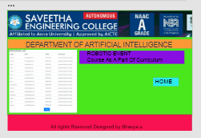

# WebApplication for Event Registration

## AIM:
To create a UX design and develop a web application for event registration.
## DESIGN STEPS:
### Step 1: 
Requirement collection.
### Step 2:
Choosing the suitable color scheme
### Step 3:
Creating artboards for individual pages
### Step 4:
Designing layout for individual pages
### Step 5:
Creating links and linking it with artboards
### Step 6:
Preview the prototype.


## DESIGN SCREENS:





## WIREFRAME:


## PROTOTYPE:


## PROGRAM:
### home.html
```
<!doctype html>
<html lang="en">

<head>
    <!-- Required meta tags -->
    <meta charset="utf-8">
    <meta name="viewport" content="width=device-width, initial-scale=1, shrink-to-fit=no">

    <!-- Bootstrap CSS -->
    <link rel="stylesheet" href="https://maxcdn.bootstrapcdn.com/bootstrap/4.0.0/css/bootstrap.min.css"
        integrity="sha384-Gn5384xqQ1aoWXA+058RXPxPg6fy4IWvTNh0E263XmFcJlSAwiGgFAW/dAiS6JXm" crossorigin="anonymous">

    <title>Saveetha Engineering College</title>
</head>

<body>
    <div class="jumbotron">
        <div class="container">
        <h1 class="display-4 text-center">ROBOTIC EVENT</h1>
        <p class="lead text-center">Course As A Part Of Cirriculum</p>
        <hr class="my-4">
        <p class="text-center">DEPARTMENT OF ARTIFICIAL INTELLIGENCE</p>
        <p class="lead text-center">
            <a class="btn btn-primary btn-lg" href="#" role="button">Learn More</a>
        </p>
        </div>
    </div>
    <div class="container">
        <div class="row">
            <div class="col-12 text-center">
                <p class ="text-center">REGISTRATION FEE:350/-</p>
                <p class ="text-center">Contact Details</p>
                 <p class ="text-center">T.Rahul,9000789789</p>
                <div class="col-12 text-center">
                    <a href="/register" class="btn btn-primary btn-lg" role="button" aria-disabled="true">Register</a>
                </div> 
            </div>
        </div>
    </div>

    <!-- Optional JavaScript -->
    <!-- jQuery first, then Popper.js, then Bootstrap JS -->
    <script src="https://code.jquery.com/jquery-3.2.1.slim.min.js"
        integrity="sha384-KJ3o2DKtIkvYIK3UENzmM7KCkRr/rE9/Qpg6aAZGJwFDMVNA/GpGFF93hXpG5KkN"
        crossorigin="anonymous"></script>
    <script src="https://cdnjs.cloudflare.com/ajax/libs/popper.js/1.12.9/umd/popper.min.js"
        integrity="sha384-ApNbgh9B+Y1QKtv3Rn7W3mgPxhU9K/ScQsAP7hUibX39j7fakFPskvXusvfa0b4Q"
        crossorigin="anonymous"></script>
    <script src="https://maxcdn.bootstrapcdn.com/bootstrap/4.0.0/js/bootstrap.min.js"
        integrity="sha384-JZR6Spejh4U02d8jOt6vLEHfe/JQGiRRSQQxSfFWpi1MquVdAyjUar5+76PVCmYl"
        crossorigin="anonymous"></script>
</body>

</html>
```
### register.html
```
<!doctype html>
<html lang="en">

<head>
    <!-- Required meta tags -->
    <meta charset="utf-8">
    <meta name="viewport" content="width=device-width, initial-scale=1, shrink-to-fit=no">

    <!-- Bootstrap CSS -->
    <link rel="stylesheet" href="https://maxcdn.bootstrapcdn.com/bootstrap/4.0.0/css/bootstrap.min.css"
        integrity="sha384-Gn5384xqQ1aoWXA+058RXPxPg6fy4IWvTNh0E263XmFcJlSAwiGgFAW/dAiS6JXm" crossorigin="anonymous">

    <title>Saveetha Engineering College</title>
</head>

<body>
    <div class="jumbotron">
        <div class="container">
            <h1 class="display-4 text-center">ROBOTIC EVENT</h1>
            <p class="lead text-center">Course As A Part Of Curriculum</p>
            <hr class="my-4">
            <p class="text-center">Department of Artificial Intelligence</p>
            <p class="lead text-center">
                <a class="btn btn-primary btn-lg" href="#" role="button">Learn More</a>
            </p>
        </div>
    </div>
    <div class="container">
        <div class="row">
            <div class="col-12">
                <h1>Application</h1>
                <form action="/register/" method="POST">
                    
                    <div class="form-group">
                        <label for="Name">Name</label>
                        <input type="name" class="form-control" name="Name" id="Name" placeholder="Name">
                    </div>
                    <div class="form-group">
                        <label for="Phone">Phone</label>
                        <input type="phone" class="form-control" name="Phone" id="Phone" placeholder="Phone">
                    </div>
                    <div class="form-group">
                        <label for="Email1">Email address</label>
                        <input type="email" class="form-control" name="Email1" id="Email1" aria-describedby="emailHelp"
                            placeholder="Enter email">
                        <small id="emailHelp" class="form-text text-muted">We'll never share your email with anyone
                            else.</small>
                    </div>
                    <div class="form-group">
                        <label for="Institution">Institution Name</label>
                        <input type="institution" class="form-control" name="Institution" id="Institution" placeholder="Institution Name">
                    </div>
                    <div class="form-check">
                        <input type="checkbox" class="form-check-input" name="examplecheck1" id="exampleCheck1">
                        <label class="form-check-label" for="exampleCheck1">Check me out</label>
                    </div>
                    <button type="submit" class="btn btn-primary">SUBMIT</button>
                </form>
            </div>
        </div>
    </div>

    <!-- Optional JavaScript -->
    <!-- jQuery first, then Popper.js, then Bootstrap JS -->
    <script src="https://code.jquery.com/jquery-3.2.1.slim.min.js"
        integrity="sha384-KJ3o2DKtIkvYIK3UENzmM7KCkRr/rE9/Qpg6aAZGJwFDMVNA/GpGFF93hXpG5KkN"
        crossorigin="anonymous"></script>
    <script src="https://cdnjs.cloudflare.com/ajax/libs/popper.js/1.12.9/umd/popper.min.js"
        integrity="sha384-ApNbgh9B+Y1QKtv3Rn7W3mgPxhU9K/ScQsAP7hUibX39j7fakFPskvXusvfa0b4Q"
        crossorigin="anonymous"></script>
    <script src="https://maxcdn.bootstrapcdn.com/bootstrap/4.0.0/js/bootstrap.min.js"
        integrity="sha384-JZR6Spejh4U02d8jOt6vLEHfe/JQGiRRSQQxSfFWpi1MquVdAyjUar5+76PVCmYl"
        crossorigin="anonymous"></script>
</body>

</html>
```
### success.html
```
<!doctype html>
<html lang="en">

<head>
    <!-- Required meta tags -->
    <meta charset="utf-8">
    <meta name="viewport" content="width=device-width, initial-scale=1, shrink-to-fit=no">

    <!-- Bootstrap CSS -->
    <link rel="stylesheet" href="https://maxcdn.bootstrapcdn.com/bootstrap/4.0.0/css/bootstrap.min.css"
        integrity="sha384-Gn5384xqQ1aoWXA+058RXPxPg6fy4IWvTNh0E263XmFcJlSAwiGgFAW/dAiS6JXm" crossorigin="anonymous">

    <title>Saveetha Engineering College</title>
</head>

<body>
    <div class="jumbotron">
        <div class="container">
            <h1 class="display-4 text-center">ROBOTIC EVENT</h1>
            <p class="lead text-center">Course As A Part Of Cirriculum</p>
            <hr class="my-4">
            <p class="text-center">Department of Artificial Intelligence</p>
            <p class="lead text-center">
                <a class="btn btn-primary btn-lg" href="#" role="button">Learn More</a>
            </p>
        </div>
    </div>
    <div class="container">
        <div class="row">
            <div class="col-12 text-center">
                <h3>Join Us And Enjoy The Event</h3>
                <div class="col-12 text-center">
                    <a href="/home" class="btn btn-primary btn-lg" role="button" aria-disabled="true">Home</a>
                </div>
                <div class="text-center">
                    <div class="alert alert-success" role="alert">
                        <h4 class="alert-heading">Congratulations!</h4>
                        <p>Your Registration is Successful.</p>
                        <hr>
                        <h4 class="alert-heading">Thank You.</h4>
                    </div>
                </div>
            </div>
        </div>
    </div>

    <!-- Optional JavaScript -->
    <!-- jQuery first, then Popper.js, then Bootstrap JS -->
    <script src="https://code.jquery.com/jquery-3.2.1.slim.min.js"
        integrity="sha384-KJ3o2DKtIkvYIK3UENzmM7KCkRr/rE9/Qpg6aAZGJwFDMVNA/GpGFF93hXpG5KkN"
        crossorigin="anonymous"></script>
    <script src="https://cdnjs.cloudflare.com/ajax/libs/popper.js/1.12.9/umd/popper.min.js"
        integrity="sha384-ApNbgh9B+Y1QKtv3Rn7W3mgPxhU9K/ScQsAP7hUibX39j7fakFPskvXusvfa0b4Q"
        crossorigin="anonymous"></script>
    <script src="https://maxcdn.bootstrapcdn.com/bootstrap/4.0.0/js/bootstrap.min.js"
        integrity="sha384-JZR6Spejh4U02d8jOt6vLEHfe/JQGiRRSQQxSfFWpi1MquVdAyjUar5+76PVCmYl"
        crossorigin="anonymous"></script>
</body>

</html>

```

### failed.html
```
<!doctype html>
<html lang="en">

<head>
    <!-- Required meta tags -->
    <meta charset="utf-8">
    <meta name="viewport" content="width=device-width, initial-scale=1, shrink-to-fit=no">

    <!-- Bootstrap CSS -->
    <link rel="stylesheet" href="https://maxcdn.bootstrapcdn.com/bootstrap/4.0.0/css/bootstrap.min.css"
        integrity="sha384-Gn5384xqQ1aoWXA+058RXPxPg6fy4IWvTNh0E263XmFcJlSAwiGgFAW/dAiS6JXm" crossorigin="anonymous">

    <title>Saveetha Engineering College</title>
</head>

<body>
    <div class="jumbotron">
        <div class="container">
            <h1 class="display-4 text-center">ROBOTIC EVENT</h1>
            <p class="lead text-center">Course As A Part Of Cirriculum</p>
            <hr class="my-4">
            <p class="text-center">Department of Artificial Intelligence</p>
            <p class="lead text-center">
                <a class="btn btn-primary btn-lg" href="#" role="button">Learn More</a>
            </p>
        </div>
    </div>
    <div class="container">
        <div class="row">
            <div class="col-12 text-center">
                <h1>Join Us And Enjoy The Event</h1>
                <div class="col-12 text-center">
                    <a href="/home" class="btn btn-primary btn-lg" role="button" aria-disabled="true">Home</a>
                </div>
                <div class="text-center">
                    <div class="alert alert-success" role="alert">
                        <h4 class="alert-heading">Sorry!</h4>
                        <p>All the seats are booked.</p>
                    </div>
                </div>
            </div>
        </div>
    </div>

    <!-- Optional JavaScript -->
    <!-- jQuery first, then Popper.js, then Bootstrap JS -->
    <script src="https://code.jquery.com/jquery-3.2.1.slim.min.js"
        integrity="sha384-KJ3o2DKtIkvYIK3UENzmM7KCkRr/rE9/Qpg6aAZGJwFDMVNA/GpGFF93hXpG5KkN"
        crossorigin="anonymous"></script>
    <script src="https://cdnjs.cloudflare.com/ajax/libs/popper.js/1.12.9/umd/popper.min.js"
        integrity="sha384-ApNbgh9B+Y1QKtv3Rn7W3mgPxhU9K/ScQsAP7hUibX39j7fakFPskvXusvfa0b4Q"
        crossorigin="anonymous"></script>
    <script src="https://maxcdn.bootstrapcdn.com/bootstrap/4.0.0/js/bootstrap.min.js"
        integrity="sha384-JZR6Spejh4U02d8jOt6vLEHfe/JQGiRRSQQxSfFWpi1MquVdAyjUar5+76PVCmYl"
        crossorigin="anonymous"></script>
</body>

</html>
```
### participants.html
```
<!doctype html>
<html lang="en">

<head>
    <!-- Required meta tags -->
    <meta charset="utf-8">
    <meta name="viewport" content="width=device-width, initial-scale=1, shrink-to-fit=no">

    <!-- Bootstrap CSS -->
    <link rel="stylesheet" href="https://maxcdn.bootstrapcdn.com/bootstrap/4.0.0/css/bootstrap.min.css"
        integrity="sha384-Gn5384xqQ1aoWXA+058RXPxPg6fy4IWvTNh0E263XmFcJlSAwiGgFAW/dAiS6JXm" crossorigin="anonymous">

    <title>Saveetha Engineering College</title>
</head>

<body>
    <div class="jumbotron">
        <div class="container">
             <h1 class="display-4 text-center">ROBOTIC EVENT</h1>
            <p class="lead text-center">Course As A Part Of Cirriculum</p>
            <hr class="my-4">
            <p class="text-center">Department of Artificial Intelligence</p>
            <p class="lead text-center">
                <a class="btn btn-primary btn-lg" href="#" role="button">Learn more</a>
            </p>
        </div>
    </div>
    <div class="container">
        <div class="row">
            <div class="col-12">
                <h3>PARTICIPANTS LIST</h3>
            </div>
        </div>
        <div class="row">
            <div class="col-12">
                <table class="table">
                    <thead>
                        <tr>
                            <th scope="col">NAME</th>
                            <th scope="col">EMAIL</th>
                            <th scope="col">PHONE</th>
                            <th scope="col">INSTITUTION</th>
                        </tr>
                    </thead>
                    <tbody>

                        <tr>
                            <td>bhavya</td>
                            <td>bhavya@gmail.com</td>
                            <td>6303583708</td>
                            <td>Saveetha Engineering College</td>
                        </tr>

                        <tr>
                            <td>Srinivas</td>
                            <td>Srinivas@gmail.com</td>
                            <td>9985749221</td>
                            <td>Saveetha Engineering College</td>
                        </tr>

                        <tr>
                            <td>obed</td>
                            <td>obed@gmail.com</td>
                            <td>9987898776</td>
                            <td>Saveetha Engineering college</td>
                        </tr>

                        <tr>
                            <td>kavya</td>
                            <td>kavya@gmail.com</td>
                            <td>9909867889</td>
                            <td>Saveetha Engineering college</td>
                        </tr>

                        <tr>
                            <td>swetha</td>
                            <td>swetha@gmail.com</td>
                            <td>9987654332</td>
                            <td>Saveetha Engineering college</td>
                        </tr>

                        <tr>
                            <td>Saran</td>
                            <td>Saran@gmail.com</td>
                            <td>9879098555</td>
                            <td>Saveetha Engineering college</td>
                        </tr>

                        <tr>
                            <td>priya</td>
                            <td>priya23@gmail.com</td>
                            <td>9998765433</td>
                            <td>Saveetha Engineering college</td>
                        </tr>

                        <tr>
                        <tr>
                            <td>kayal</td>
                            <td>kayal77@gmail.com</td>
                            <td>8909876789</td>
                            <td>Saveetha Engineering college</td>
                        </tr>

                        <tr>
                            <td>sandhya charu</td>
                            <td>charu89@gmail.com</td>
                            <td>8000987680</td>
                            <td>Saveetha Engineering college</td>
                        </tr>

                        <tr>
                            <td>Harshini</td>
                            <td>Harshi34@gmail.com</td>
                            <td>7000678967</td>
                            <td>Saveetha Engineering college</td>
                        </tr>

                        <tr>
                            <td>sanjana</td>
                            <td>sanju45@gmail.com</td>
                            <td>6302181823</td>
                            <td>Saveetha Engineering college</td>
                        </tr>

                        <tr>
                            <td>dhayanitha</td>
                            <td>dhaya90@gmail.com</td>
                            <td>6302181814</td>
                            <td>Saveetha Engineering college</td>
                        </tr>

                        <tr>
                            <td>sahitya</td>
                            <td>sahitya23@gmail.com</td>
                            <td>9087765788</td>
                            <td>Saveetha Engineering college</td>
                        </tr>

                        <tr>
                            <td>vidya</td>
                            <td>vidya45@gmail.com</td>
                            <td>9998765789</td>
                            <td>Saveetha Engineering college</td>
                        </tr>

                         <tr>
                            <td>sushma</td>
                            <td>sush3456@gmail.com</td>
                            <td>9998765788</td>
                            <td>Saveetha Engineering college</td>
                        </tr>


                    </tbody>
                </table>
            </div>
        </div>
        <div class="row">
            <div class="col-12 text-center">
                <a href="/home/" class="btn btn-primary btn-lg" role="button">Home</a>
            </div>
        </div>
    </div>

    <!-- Optional JavaScript -->
    <!-- jQuery first, then Popper.js, then Bootstrap JS -->
    <script src="https://code.jquery.com/jquery-3.2.1.slim.min.js"
        integrity="sha384-KJ3o2DKtIkvYIK3UENzmM7KCkRr/rE9/Qpg6aAZGJwFDMVNA/GpGFF93hXpG5KkN"
        crossorigin="anonymous"></script>
    <script src="https://cdnjs.cloudflare.com/ajax/libs/popper.js/1.12.9/umd/popper.min.js"
        integrity="sha384-ApNbgh9B+Y1QKtv3Rn7W3mgPxhU9K/ScQsAP7hUibX39j7fakFPskvXusvfa0b4Q"
        crossorigin="anonymous"></script>
    <script src="https://maxcdn.bootstrapcdn.com/bootstrap/4.0.0/js/bootstrap.min.js"
        integrity="sha384-JZR6Spejh4U02d8jOt6vLEHfe/JQGiRRSQQxSfFWpi1MquVdAyjUar5+76PVCmYl"
        crossorigin="anonymous"></script>
</body>

</html>
```


## OUTPUT:


## RESULT:
 Thus, a UX design is created and a web application is developed for event registration is the url http://bhavya.student.saveetha.in:8000/home/
